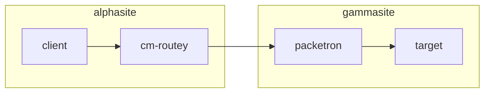

# Networking
Documentation on network designs and configuration steps.


## Site to Site Connections
Initially OpenVPN was set up with the previous client access main VPN on Packetron, but its client-server design
leaves some issues with routing, so second attempt (below) uses a P2P VPN config.

This configuration is heavily inspired from the netgate docs [here](https://docs.netgate.com/pfsense/en/latest/recipes/openvpn-s2s-psk.html),
with lots of modifications and experimentation needed to get it working with an OpenWRT client site.
OpenWRT really doesnt provide any help for the VPN setup, you need to know all the options to
make it work properly. Briefly looked at IPsec tunnel but that is really hardcore with OpenWRT so
left it off for now. May revisit.

### OpenVPN Tunnel Experimental Setup
**Objective**: connect two sites via a seamless tunnel so that machines in one can
easily connect to resources in the other without needing VPN software on the clients.

Notes on the setup:
* `Alphasite` is the "core" site here, running the OpenVPN server
  * Router: `packetron` - running PFsense
  * Domain: `glenside.lan`
* `Gammasite` is an "edge" site
  * Router: `cm-routey` - running OpenWRT
  * Domain: `gammasite.lan`





Steps to create:
* Created certificates on `packetron` as per document:
  * Server Cert: `P2P VPN Server Cert`
  * Client Cert: `Gammasite P2P VPN`
  * Downloaded Root CA Cert, CLient Cert and Key temporarily, uploaded to `cm-routey` (filenames below in config)
* Added VPN Server Config to `packetron` as advised by the docs
  * Port 1195 as 1194 was already in use
  * Server certificate uses cert created above
  * IPv4 Tunnel network: `10.1.2.0/24` - since the first VPN is using `10.1.1.0/24`,
    and we only need one IP address per site
  * IPv4 Local Network: `10.0.0.0/16` - allows access to the full LAN in alphasite (may restrict to server range in future)
  * IPv4 Remote Network: `192.168.0.0/24` - creates a reverse route for hosts in alphasite to respond
  * Compression: `Adaptive LZO Compression` - set for easier match on OpenWRT
  * Gateway creation: IPv4Only - less cruft!
* Created VPN config on packetron, using the below file (this took a while to build out)
  ```
  config openvpn 'packetron_p2p'
          option dev 'tun'
          option nobind '1'
          option verb '3'
          option port '1195'
          list remote 'alphasite.garvbox.net'
          option ca '/etc/openvpn/Packetron+Root+CA.crt'
          option cert '/etc/openvpn/Gammasite+P2P+VPN.crt'
          option dev_type 'tun'
          option key '/etc/openvpn/Gammasite+P2P+VPN.key'
          option client '1'
          option client_to_client '0'
          option enabled '1'
          option comp_lzo 'adaptive'
          option tun_mtu '1500'
          option cipher 'AES-128-CBC'
          option ncp_ciphers 'AES-128-GCM'
          option auth 'SHA256'
          option tls_auth '/etc/openvpn/Packetron_P2P_TLS.key'
          option key_direction '1'
  ```
  At this point the vpn connection was up (with `/etc/init.d/openvpn restart`)
* Created a new firewall zone in the openWRT UI (Network->Firewall->Add)
  * Named this alphasite as it represents the target site zone
  * Input/Output/Forward all set to accept
  * Set "allow forward to" and "allow forward from" zones both to include LAN zone, allowing traffic in and out
  * In Advanced settings -> covered devices, added `tun0` for the VPN tunnel device
  * Hit save and apply
* Set up DNS on `cm-routey`:
  * On Network->DHCP and DNS, add `/glenside.lan/10.0.0.1` to DNS forwardings
  * Add `glenside.lan` to Domain Whitelist to allow local IPs through rebind protection
  * Add `lan` and `tun0` as listen interfaces to allow the DNS resolver listen to the VPN tunnel interface
* Set up DNS on `packetron`:
  * On PFsense go to DNS resolver settings and add the following to custom options:  
  `private-domain: "gammasite.lan"`
  * Still in DNS resolver settings, under Domain overrides, add an entry for
  `gammasite.lan` pointing to server `192.168.0.1`
  * Disable DNSSEC support if enabled
  * Go to "Access Lists" and create an "allow" list for the gammasite network range.
    * Access list name: `VPN LANs` (so that we can add more ranges for other vpn tunnels)
    * Networks: `192.168.0.0/24`
