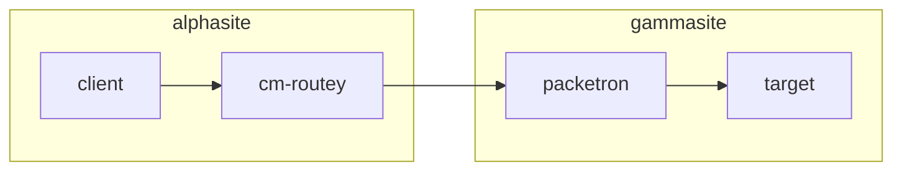

# Networking
Documentation on network designs and configuration steps.


## Site to Site Connections
Initial experiment with OpenVPN tunneling was pretty successful (see below) however its client-server design
leaves some issues. It works well for the sub-site connecting in to main (alphasite) but connecting
out from the main site to the others has routing issues.

### OpenVPN Tunnel Experimental Setup
**Objective**: connect two sites via a seamless tunnel so that machines in one can
easily connect to resources in the other without needing VPN software on the clients.

Notes on the setup:
* `Alphasite` is the "core" site here, running the OpenWRT server
  * Router: `packetron` - running PFsense
  * Domain: `glenside.lan`
* `Gammasite` is an "edge" site
  * Router: `cm-routey` - running OpenWRT
  * Domain: `gammasite.lan`





Steps to create:
* Created a user on `packetron` for generation of a client cert. Stored password in keepass `ServerKeys.kdbx` on owncloud.
* No real configuration on packetron required, from that side its a pretty normal client, just generated
  the usual client config from packetron UI.
* Imported client config to `cm-routey`, some changes needed:
  * under the "client" section, added the below lines. This is to disable pushing routes to the client router as
    that would force all traffic from the client network through alphasite, which is not what we want.
    ```
    route 10.0.0.0 255.0.0.0 10.1.1.1
    route-nopull
    ```
  * Updated auth line: `auth-user-pass /etc/openvpn/PacketronVPN.auth`
  * Added user and password to the provided auth file from UI, user and pass on seperate lines
  * Started the VPN in openWRT and checked it came online. At this point could ping packetron from the 
    router but not from clients on the network.
  * This was useful on the openwrt router to check logs and debug issues with VPN: `# logread -e openvpn -f`
* Created a new firewall zone in the openWRT UI (Network->Firewall->Add)
  * Named this alphasite as it represents the target site zone
  * Added `tun0` as the interface, this is auto-created by openVPN
  * Input/Output/Forward all set to accept
  * IP Masquerading (NAT) enabled
    * this basically means we dont have to worry about routing from alphasite back to gammasite as we are like a NAT there.
    * It also means that client machines on gammasite are not directly accessible from client machines in alphasite.
  * Set "allow forward to" and "allow forward from" zones both to include LAN zone, allowing traffic in and out
  * Hit save and apply - should be working now
* Create a DNS forwarding rule on `cm-routey`
  * On Network->DHCP and DNS, add `/glenside.lan/10.0.0.1` to DNS forwardings
  * Add `glenside.lan` to Domain Whitelist to allow local IPs through rebind protection
